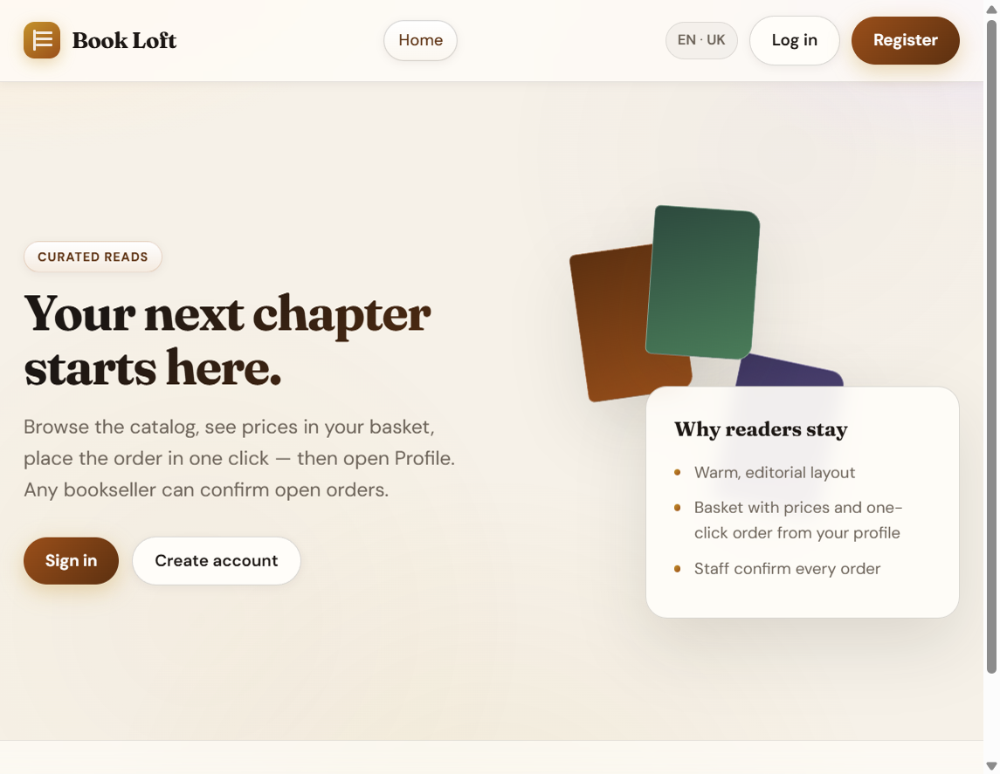
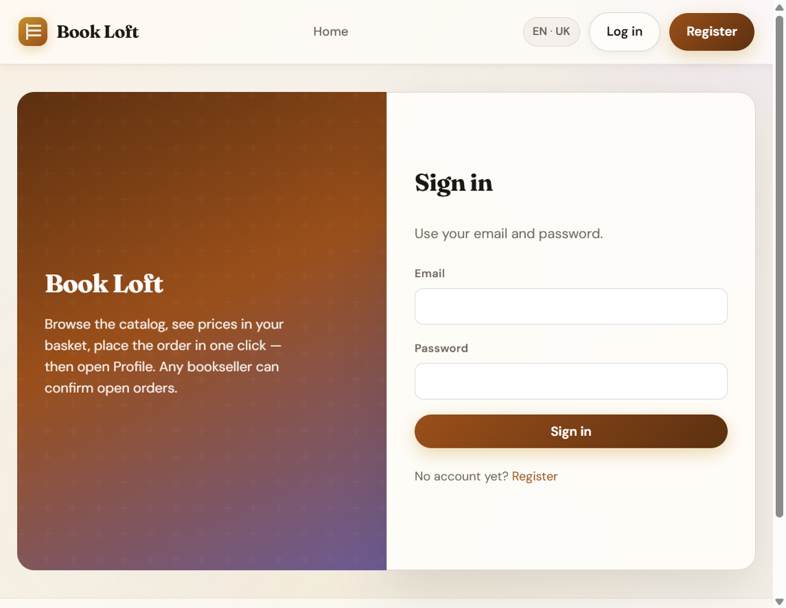
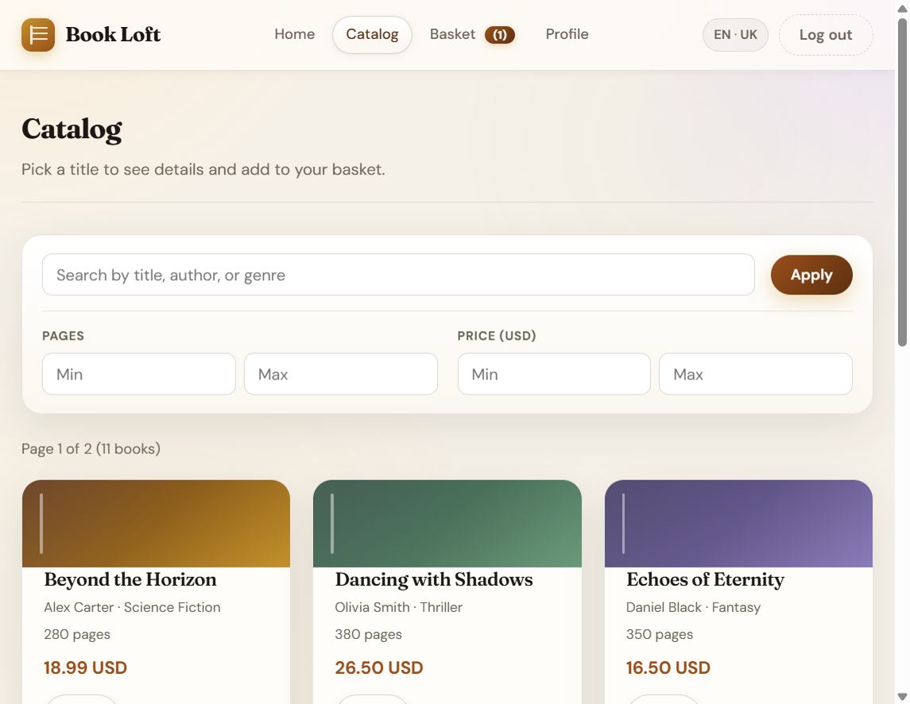
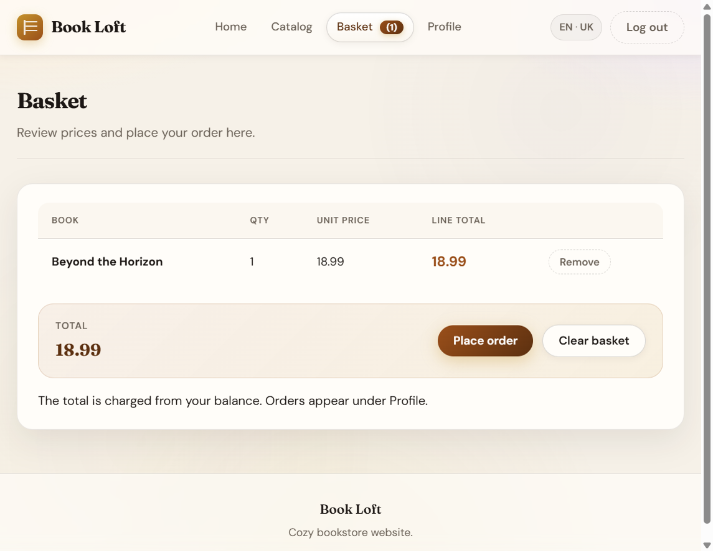
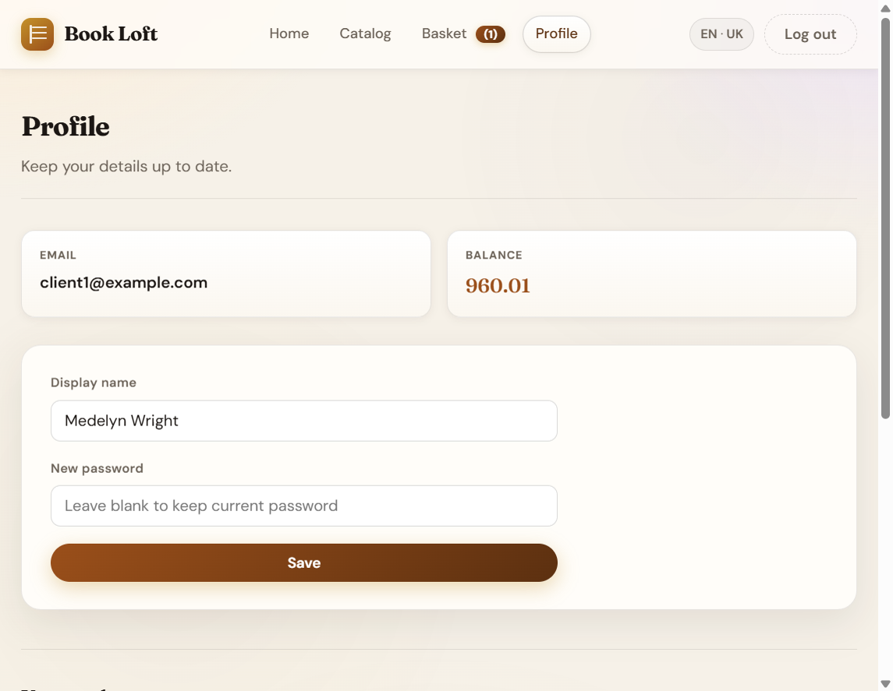
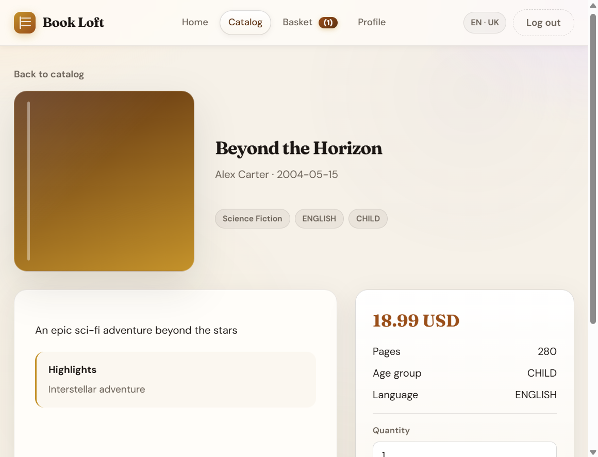
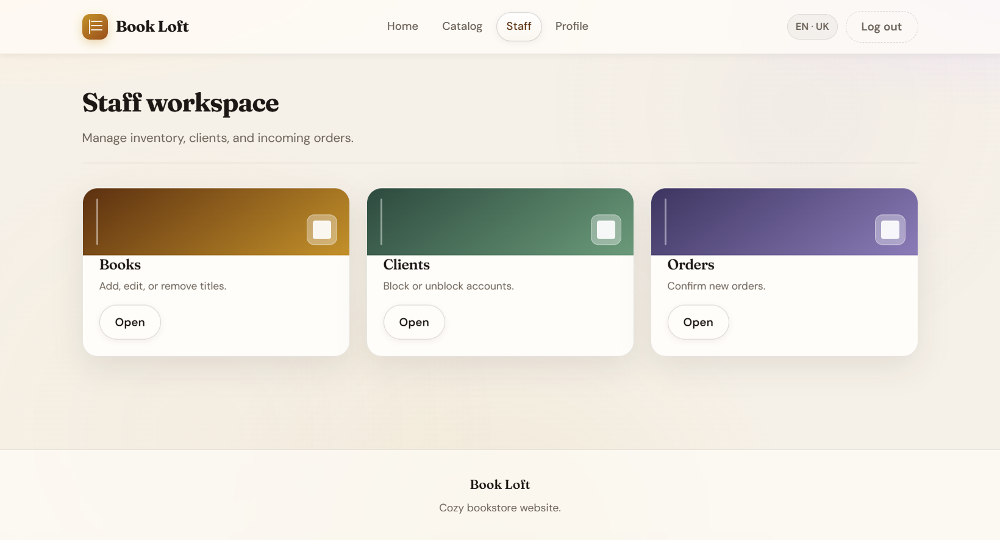
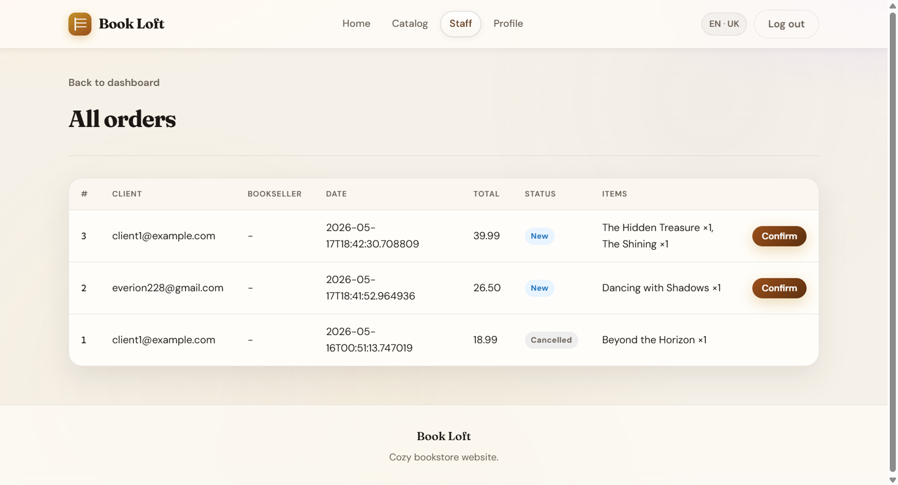
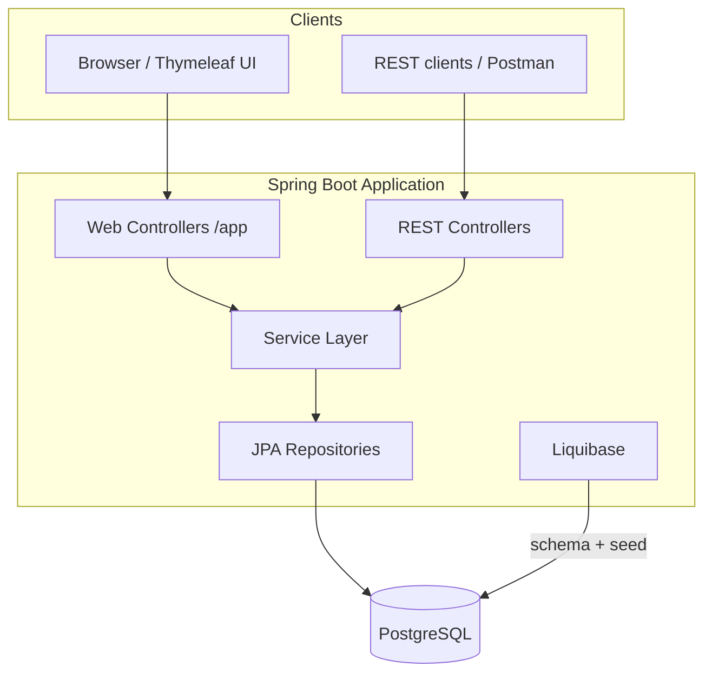

# Book Loft — Online Bookstore Platform

[](https://openjdk.org/)
[](https://spring.io/projects/spring-boot)
[](https://www.postgresql.org/)
[](https://www.liquibase.com/)
[](./src/test)
[](LICENSE)

> Full-stack bookstore with **role-based access** (customer & staff), **persistent shopping basket**, order workflow, bilingual UI, **Liquibase** database migrations, and a **REST API** alongside a polished **Thymeleaf** web app.

**Live demo (local):** `http://localhost:8084`

---

## Why this project matters 

| What you can evaluate | How it is demonstrated |
|----------------------|-------------------------|
| **Backend engineering** | Layered Spring Boot app, JPA, Liquibase migrations, transactions, business rules (balance, order states) |
| **Security** | Spring Security, BCrypt, CSRF on web forms, role-based endpoints |
| **API design** | REST resources for books, clients, employees, orders, basket, profile |
| **Frontend craft** | Custom design system, responsive layout, progressive enhancement with vanilla JS |
| **Quality** | **240 automated tests**, Liquibase seed data, validation, i18n (EN / UK) |
| **Real-world flows** | Catalog → basket → checkout → staff fulfillment pipeline |

---

## Screenshots

### Landing & authentication

| Home | Sign in |
|------|---------|
|  |  |

### Customer journey

| Catalog (search & filters) | Basket & checkout |
|---------------------------|-------------------|
|  |  |

| Profile (balance & orders) | Book details |
|---------------------------|--------------|
|  |  |

### Staff workspace

| Dashboard | Order management |
|-----------|------------------|
|  |  |

---

## Features

### Customer (`ROLE_CLIENT`)

- Browse catalog with **live search**, price/page filters, pagination
- **AJAX add-to-basket** with toast notifications and basket badge
- **Persistent basket** stored in PostgreSQL (survives logout)
- Checkout charges **account balance**; view & cancel `NEW` orders in profile
- Self-service **registration** with client-side + server-side validation
- **Ukrainian / English** UI toggle

### Staff (`ROLE_EMPLOYEE`)

- **CRUD** book inventory with search & filters
- **Block / unblock** clients
- **Order pipeline:** `NEW` → `CONFIRMED` → `SHIPPED` → `DELIVERED`
- Staff dashboard + orders table with **auto-refresh** (30s)
- Assign themselves to open orders on confirm

### Platform

- **Dual interface:** human-friendly `/app/*` web UI + machine-friendly REST API
- Centralized error handling (JSON for API, friendly pages for web)
- **Liquibase** schema + demo seed on startup (versioned changelogs)
- Hibernate `validate` only — no auto DDL at runtime
- Optional `application-local.properties` for secrets (not committed)

---

## Tech stack

| Layer | Technology |
|-------|------------|
| Language | Java 17 |
| Framework | Spring Boot 3.2 (Web, Data JPA, Security, Validation, AOP) |
| View | Thymeleaf + Spring Security extras |
| Database | PostgreSQL (runtime), H2 (tests) |
| Migrations | Liquibase (`src/main/resources/db/changelog/`) |
| Mapping | ModelMapper |
| Build | Maven |
| UI | CSS3, vanilla JavaScript |
| Fonts | Fraunces, DM Sans (Google Fonts) |

---

## Architecture



**Packages:** `controller` (REST) · `controller.web` (MVC) · `service` · `repo` · `model` · `security` · `dto`

---

## Order lifecycle

```text
[Basket] --checkout--> NEW
NEW --cancel (client)--> CANCELLED (+ refund to balance)
NEW --confirm (staff)--> CONFIRMED (staff assigned)
CONFIRMED --ship--> SHIPPED
SHIPPED --deliver--> DELIVERED
```

---

## Quick start

### Prerequisites

- **JDK 17+**
- **Maven 3.9+**
- **PostgreSQL** with database `book_store`

### 1. Database

```sql
CREATE DATABASE book_store;
```

### 2. Local configuration

Copy the example and set your password:

```bash
cp src/main/resources/application-local.properties.example src/main/resources/application-local.properties
```

Edit `application-local.properties`:

```properties
spring.datasource.password=YOUR_PASSWORD
```

### 3. Run

```bash
mvn spring-boot:run
```

Open **http://localhost:8084**

On first startup, **Liquibase** creates the schema and loads demo data automatically.

### 4. Test

```bash
mvn test
```

---

## Database migrations (Liquibase)

Schema and seed data are managed by **Liquibase**, not Hibernate DDL or `spring.sql.init`.

| File | Purpose |
|------|---------|
| `db/changelog/db.changelog-master.yaml` | Root changelog |
| `db/changelog/changes/001-initial-schema.yaml` | 6 tables, FKs, unique constraints |
| `db/changelog/changes/002-seed-data.yaml` | Demo data (runs only when `books` is empty) |
| `db/changelog/changes/002-seed-data.sql` | Employees, clients, books inserts |

**Startup order:** Liquibase applies pending changesets → Hibernate validates entities against the DB (`ddl-auto=validate`) → app is ready.

**Tables (6):** `books`, `clients`, `employees`, `orders`, `book_items`, `basket_entries`

**Fresh local database** — only `CREATE DATABASE book_store;` is required; Liquibase does the rest.

**Existing DB from an older Hibernate `update` setup** — for a clean migration, recreate the database:

```sql
DROP DATABASE book_store;
CREATE DATABASE book_store;
```

`001-initial-schema` skips table creation if `books` already exists (`preConditions`). `002-seed-data` skips inserts if `books` already has rows.

`src/main/resources/sql/sql.sql` is kept as a **legacy reference copy** of the seed; it is **not** executed at runtime.

---

## Demo accounts

All seeded users share the password **`password123`** (BCrypt hash in Liquibase seed).

| Role | Email | What to try |
|------|-------|-------------|
| Customer | `client1@example.com` | Catalog, basket, profile, orders |
| Staff | `john.doe@email.com` | `/app/employee` — books, clients, orders |

More clients: `client2@example.com` … `client10@example.com` · more staff in `002-seed-data.sql`.

---

## API overview (REST)

Authenticated via **HTTP Basic** or session (after form login). CSRF disabled for REST paths.

| Resource | Base path | Notes |
|----------|-----------|--------|
| Books | `/books` | Search, CRUD by title |
| Clients | `/clients` | CRUD, registration |
| Employees | `/employees` | CRUD, block/unblock clients |
| Orders | `/orders` | List, create, checkout, status transitions |
| Basket | `/basket` | Per authenticated client |
| Profile | `/profile` | Update account |

**Web-only JSON (AJAX):**

- `GET /app/basket/summary`
- `POST /app/basket/add?ajax=true`
- `GET /app/books/search`
- `GET /app/employee/orders/data`

---

## Project structure

```text
src/main/java/com/spring/project/
├── controller/          # REST API
├── controller/web/      # Thymeleaf MVC (/app/*)
├── service/             # Business logic
├── repo/                # Spring Data JPA
├── model/               # Entities & enums
├── security/            # UserDetailsService, login handler
├── dto/                 # API & form DTOs
└── conf/                # Security, ModelMapper

src/main/resources/
├── db/changelog/        # Liquibase schema + seed migrations
├── templates/           # Thymeleaf HTML
├── static/css|js/       # UI assets
├── messages*.properties # i18n
├── application.properties
└── sql/sql.sql          # Legacy seed reference (not used at runtime)
```

---

## Testing

- **240** test cases (`mvn test`)
- **39** test classes
- H2 in-memory DB with profile `test` (`application-test.properties`)
- Same Liquibase changelogs applied to H2 before tests run
- Coverage includes controllers (REST + web), services, models, DTOs, security seed hashes

---

## Configuration

| Property | Default | Description |
|----------|---------|-------------|
| `server.port` | `8084` | HTTP port |
| `spring.datasource.url` | `jdbc:postgresql://localhost:5432/book_store` | DB URL |
| `spring.jpa.hibernate.ddl-auto` | `validate` | Hibernate checks schema only; no auto DDL |
| `spring.liquibase.change-log` | `classpath:db/changelog/db.changelog-master.yaml` | Migrations + seed |

Environment variables: `SPRING_DATASOURCE_URL`, `SPRING_DATASOURCE_USERNAME`, `SPRING_DATASOURCE_PASSWORD`.

---

## Author

**Andriy**, [GitHub](https://github.com/staffi125), [LinkedIn](https://www.linkedin.com/in/andriy-hrytsenyuk-826939339/).

---

## License

MIT — see [LICENSE](LICENSE) (add a LICENSE file if you publish publicly).
